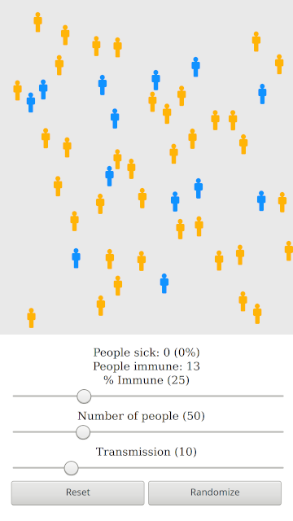

# Herd Immunity Visualization

This is a simple web app that visually demonstrates the concept of "herd immunity". 

The app renders a number of individuals, some with immunity to a disease, and other susceptible. Clicking on an individual causes them to become sick, which also causes nearby individuals to become sick as well. The contagion spreads until there are no more individuals within range to infect.

The user can control the number of individuals, the percent immune, and the transmission distance of the disease.

## Screenshots

